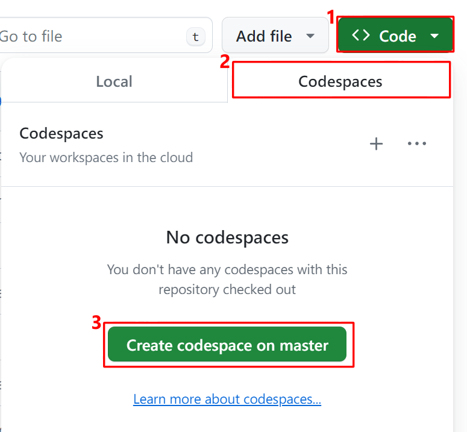

# Guide for using Codespaces to reproduce a pymatgen bug

[Codespaces](https://docs.github.com/en/codespaces/overview) allow you to use our preconfigured python environment to reproduce pymatgen issues, free of the hassle to set up the env, collect information and reproduce the issue with a single click.

## Create a codespace for pymatgen

1. Open up the [pymatgen repo](https://github.com/materialsproject/pymatgen) in your web browser.
2. Click the green <kbd>Code</kbd> button at the top-right corner of the repo, and switch to the `Codespaces` panel.
3. `Create code space on master` to create a new codespace, or to return to an existing codespace.

## Reproduce your bug and send us your outputs.
