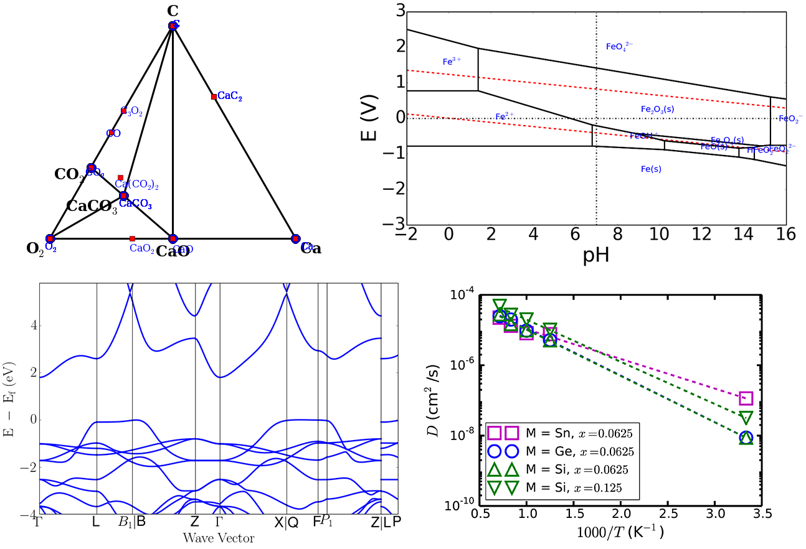
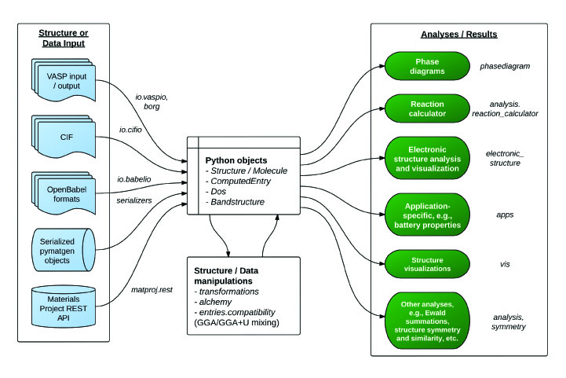

.. image:: _static/pymatgen.png
   :width: 300 px
   :alt: pymatgen
   :align: center

Introduction
============

.. image:: https://coveralls.io/repos/github/materialsproject/pymatgen/badge.svg?branch=master

Pymatgen (Python Materials Genomics) is a robust, open-source Python library
for materials analysis. These are some of the main features:

1. Highly flexible classes for the representation of Element, Site, Molecule,
   Structure objects.
2. Extensive input/output support, including support for VASP
   (http://cms.mpi.univie.ac.at/vasp/), ABINIT (http://www.abinit.org/), CIF,
   Gaussian, XYZ, and many other file formats.
3. Powerful analysis tools, including generation of phase diagrams, Pourbaix
   diagrams, diffusion analyses, reactions, etc.
4. Electronic structure analyses, such as density of states and band structure.
5. Integration with the Materials Project REST API.

Pymatgen is free to use. However, we also welcome your help to improve this
library by making your own contributions.  These contributions can be in the
form of additional tools or modules you develop, or feature requests and bug
reports. Please report any bugs and issues at pymatgen's `Github Issues
page <https://github.com/materialsproject/pymatgen/issues>`_. If you wish to
be notified of pymatgen releases and need help with using pymatgen, please
become a member of `pymatgen's Google Groups`_.

    *The code is mightier than the pen.*

Matgenie & Examples
===================

The `Materials Virtual Lab`_ has developed a
`matgenie web app <http://matgenie.materialsvirtuallab.org>`_ which
demonstrates some of the basic functionality of pymatgen.

Another good way to explore the functionality of pymatgen is to look at the
examples in a :doc:`series of ipython notebooks </examples>`.
Below are a quick look at some of the graphical output possible.

   Top: (left) Phase and (right) Pourbaix diagram from the Materials API.
   Bottom left: Calculated bandstructure plot using pymatgen's parsing and
   plotting utilities. Bottom right: Arrhenius plot using pymatgen's
   DiffusionAnalyzer.

Why use pymatgen?
=================

There are many materials analysis codes out there, both commerical and free.
So you might ask - why should I use pymatgen over others? Pymatgen offer
several advantages over other codes out there:

1. **It is (fairly) robust.** Pymatgen is used by thousands of researchers,
   and is the analysis code powering the `Materials Project`_. The analysis it
   produces survives rigorous scrutiny every single day. Bugs tend to be
   found and corrected quickly. Pymatgen also uses
   `CircleCI <https://circleci.com>`_ for continuous integration, which ensures
   that every commit passes a comprehensive suite of unittests. The coverage of
   the unittests can be seen at `here <coverage/index.html>`_.
2. **It is well documented.** A fairly comprehensive documentation has been
   written to help you get to grips with it quickly.
3. **It is open.** You are free to use and contribute to pymatgen. It also means
   that pymatgen is continuously being improved. We have a policy of
   attributing any code you contribute to any publication you choose.
   Contributing to pymatgen means your research becomes more visible, which
   translates to greater impact.
4. **It is fast.** Many of the core numerical methods in pymatgen have been
   optimized by vectorizing in numpy. This means that coordinate
   manipulations are extremely fast and are in fact comparable to codes
   written in other languages. Pymatgen also comes with a complete system for
   handling periodic boundary conditions.
5. **It will be around.** Pymatgen is not a pet research project. It is used in
   the well-established Materials Project. It is also actively being developed
   and maintained by the Materials Virtual Lab, the ABINIT group and many other
   research groups. The plan is to make sure pymatgen will stand the test of
   time and be the de facto analysis code for most materials and structural
   analysis.

With effect from version 3.0, pymatgen now supports both Python 2.7 as well
as Python 3.x. For developers working to add new features to pymatgen, this
also means that all new code going forward has to be Python 2.7+ and 3
compatible. Our approach is to have a single codebase support Python 2.7 and
3.x, as per current best practices. Please review the `coding guidelines
</contributing>`_.

.. include:: latest_changes.rst

:doc:`Older versions </change_log>`

Getting pymatgen
================

Guided install
--------------

For users who intend to use pymatgen purely as an analysis library (without
developing on it), a user-friendly script has been written to guide users
through the installation process for 64-bit Linux and Mac users. This
installation script requires only basic *Python 2.7+, setuptools,
and a working version of gcc* as prerequisites. Click to download the
`pmg_install.py <_static/pmg_install.py>`_ script. Move the script to an
empty directory and then run::

    python pmg_install.py

Unless you are working in a virtual environment, you will probably need to
run the above command with admin privileges (e.g., sudo). This will install
pymatgen with all *basic dependencies*.

To include more optional dependencies, build the enumlib and bader
executables as well as a step-by-step initial setup for POTCARs and Materials
API usage, run::

    python pmg_install.py -f

The full installation requires a Fortran compiler (ifort or gfortran) to be in
the PATH, as well as X11 (`XQuartz <http://xquartz.macosforge.org/>`_ on Mac)
to be installed for matplotlib.

Stable version
--------------

.. note:: Preparation

    Before installing pymatgen, you may need to first install a few critical
    dependencies manually.

    1. Installation has been tested to be most successful with gcc,
       and several dependencies have issues with icc. Use gcc where
       possible and do "export CC=gcc" prior to installation.
    2. Numpy's distutils is needed to compile the spglib and pyhull
       dependencies. This should be the first thing you install.
    3. Although PyYaml can be installed directly through pip without
       additional preparation, it is highly recommended that you install
       pyyaml with the C bindings for speed. To do so, install LibYaml first,
       and then install pyyaml with the command below (see the `pyyaml
       doc <http://pyyaml.org/wiki/PyYAML>`_ for more information)::

           python setup.py --with-libyaml install

The version at the Python Package Index (PyPI) is always the latest stable
release that is relatively bug-free. The easiest way to install pymatgen on
any system is to use easy_install or pip, as follows::

    easy_install pymatgen

or::

    pip install pymatgen

Detailed installation instructions for various platforms (Mac and Windows)
are given on this :doc:`page </installation>`, including how to setup your
machine for POTCAR generation, Materials Project REST interface usage, etc.

.. toctree::
   :maxdepth: 2

   installation

Developmental version
---------------------

The bleeding edge developmental version is at the pymatgen's `Github repo
<https://github.com/materialsproject/pymatgen>`_. The developmental
version is likely to be more buggy, but may contain new features. The
Github version include test files as well for complete unit testing. After
cloning the source, you can type::

    python setup.py install

or to install the package in developmental mode::

    python setup.py develop

To run the very comprehensive suite of unittests included with the
developmental version, make sure you have nose installed and then just type::

    nosetests

in the pymatgen root directory.

Note on Shared Compute Cluster Installation
-------------------------------------------

If you are installing pymatgen on shared computing clusters, e.g., the XSEDE
or NERSC resources in the US, there are several things you need to take note of:

1. Some older clusters have Python 2.6 or older by default. Pymatgen requires
   Python 2.7 or newer. Sometimes, the cluster may have Python 2.7 that you
   can load, e.g., using "module load python/2.7". Otherwise, you are out of
   luck and you need to contact the cluster admin to install python 2.7 or
   you can try to install it in your home directory.
2. Unless you are the sys admin, you will not have write access to the default
   locations that python installs packages. What you need to do is to install
   pymatgen (and other dependencies) using the "--user" option::

    pip install pymatgen --user
    # or python setup.py develop --user if you are installing the dev version.

   This will install pymatgen in your $HOME/.local/lib/python2.7/site-packages.
   You may need to add this to your PYTHONPATH variable, e.g., in your
   .bash_profile if it is not automatically set.

"Sample" Docker version
-----------------------

If you would like to try out pymatgen's capabilities before committing to an
install, one way is to use `Docker <http://www.docker.com/>`_. The
`Materials Virtual Lab`_ has created an Docker image for the latest version of
pymatgen. After installing Docker for your platform, you may pull and run the
pymatgen Docker image as follows::

    docker pull materialsvirtuallab/pymatgen
    docker run -t -i materialsvirtuallab/pymatgen

This will run ipython shell where you can import pymatgen and run most of the
examples. If you want to use your own files to run some examples, you may
mount a directory in your host computer containing the files you wish to work
in the docker container using the -v option. For example, let's say you have
your files in the /Users/myname/research directory. You may then run docker
as follows::

    docker run -t -i -v /Users/myname/research:/opt/research materialsvirtuallab/pymatgen

Using pymatgen
==============

   Overview of a typical workflow for pymatgen.

The figure above provides an overview of the functionality in pymatgen. A
typical workflow would involve a user converting data (structure, calculations,
etc.) from various sources (first principles calculations, crystallographic and
molecule input files, Materials Project, etc.) into Python objects using
pymatgen's io packages, which are then used to perform further structure
manipulation or analyses.

.. _quick_start:

Quick start
-----------

Useful aliases for commonly used objects are now provided. Supported objects
include Element, Composition, Structure, Molecule, Spin and Orbital. Here are
some quick examples of the core capabilities and objects:

.. code-block:: pycon

    >>> import pymatgen as mg
    >>>
    >>> si = mg.Element("Si")
    >>> si.atomic_mass
    28.0855
    >>> si.melting_point
    u'1687 K'
    >>>
    >>> comp = mg.Composition("Fe2O3")
    >>> comp.weight
    159.6882
    >>> #Note that Composition conveniently allows strings to be treated just
    >>> #like an Element object.
    >>> comp["Fe"]
    2.0
    >>> comp.get_atomic_fraction("Fe")
    0.4
    >>> lattice = mg.Lattice.cubic(4.2)
    >>> structure = mg.Structure(lattice, ["Cs", "Cl"],
    ...                          [[0, 0, 0], [0.5, 0.5, 0.5]])
    >>> structure.volume
    74.088000000000008
    >>> structure[0]
    PeriodicSite: Cs (0.0000, 0.0000, 0.0000) [0.0000, 0.0000, 0.0000]
    >>>
    >>> # You can create a Structure using spacegroup symmetry as well.
    >>> li2o = mg.Structure.from_spacegroup("Fm-3m", mg.Lattice.cubic(3),
                                            ["Li", "O"],
                                            [[0.25, 0.25, 0.25], [0, 0, 0]])
    >>>
    >>> #Integrated symmetry analysis tools from spglib.
    >>> from pymatgen.symmetry.analyzer import SpacegroupAnalyzer
    >>> finder = SpacegroupAnalyzer(structure)
    >>> finder.get_spacegroup_symbol()
    'Pm-3m'
    >>>
    >>> # Convenient IO to various formats. You can specify various formats.
    >>> # Without a filename, a string is returned. Otherwise,
    >>> # the output is written to the file. If only the filenmae is provided,
    >>> # the format is intelligently determined from a file.
    >>> structure.to(fmt="poscar")
    >>> structure.to(filename="POSCAR")
    >>> structure.to(filename="CsCl.cif")
    >>>
    >>> # Reading a structure is similarly easy.
    >>> structure = mg.Structure.from_str(open("CsCl.cif").read(), fmt="cif")
    >>> structure = mg.Structure.from_file("CsCl.cif")
    >>>
    >>> # Reading and writing a molecule from a file. Supports XYZ and
    >>> # Gaussian input and output by default. Support for many other
    >>> # formats via the optional openbabel dependency (if installed).
    >>> methane = mg.Molecule.from_file("methane.xyz")
    >>> mol.to("methane.gjf")
    >>>
    >>> # Pythonic API for editing Structures and Molecules (v2.9.1 onwards)
    >>> # Changing the specie of a site.
    >>> structure[1] = "F"
    >>> print(structure)
    Structure Summary (Cs1 F1)
    Reduced Formula: CsF
    abc   :   4.200000   4.200000   4.200000
    angles:  90.000000  90.000000  90.000000
    Sites (2)
    1 Cs     0.000000     0.000000     0.000000
    2 F     0.500000     0.500000     0.500000
    >>>
    >>> #Changes species and coordinates (fractional assumed for structures)
    >>> structure[1] = "Cl", [0.51, 0.51, 0.51]
    >>> print(structure)
    Structure Summary (Cs1 Cl1)
    Reduced Formula: CsCl
    abc   :   4.200000   4.200000   4.200000
    angles:  90.000000  90.000000  90.000000
    Sites (2)
    1 Cs     0.000000     0.000000     0.000000
    2 Cl     0.510000     0.510000     0.510000
    >>>
    >>> # Because structure is like a list, it supports most list-like methods
    >>> # such as sort, reverse, etc.
    >>> structure.reverse()
    >>> print(structure)
    Structure Summary (Cs1 Cl1)
    Reduced Formula: CsCl
    abc   :   4.200000   4.200000   4.200000
    angles:  90.000000  90.000000  90.000000
    Sites (2)
    1 Cl     0.510000     0.510000     0.510000
    2 Cs     0.000000     0.000000     0.000000
    >>>
    >>> # Molecules function similarly, but with Site and cartesian coords.
    >>> # The following changes the C in CH4 to an N and displaces it by 0.01A
    >>> # in the x-direction.
    >>> methane[0] = "N", [0.01, 0, 0]

The above illustrates only the most basic capabilities of pymatgen. Users are
strongly encouraged to explore the :doc:`usage pages </usage>` (toc given below).

.. toctree::
   :maxdepth: 2

   usage

API documentation
-----------------

For detailed documentation of all modules and classes, please refer to the
:doc:`API docs </modules>`.

More resources
--------------

The founder and maintainer of pymatgen, Shyue Ping Ong, has conducted several
workshops (together with Anubhav Jain) on how to effectively use pymatgen (as
well as the extremely useful `custodian`_ error management and `FireWorks`_
workflow software. The slides for these workshops are available on the
`Materials Virtual Lab`_.

pmg - Command line tool
-----------------------

To demonstrate the capabilities of pymatgen and to make it easy for users to
quickly use the functionality, pymatgen comes with a set of useful scripts
that utilize the library to perform all kinds of analyses. These are
installed to your path by default when you install pymatgen through the
typical installation routes.

Here, we will discuss the most versatile of these scripts, known as
pmg. The typical usage of pmg is::

    pmg {analyze, plotdos, plotchgint, convert, symm, view, compare} additional_arguments

At any time, you can use ``"pmg --help"`` or ``"pmg subcommand
--help"`` to bring up a useful help message on how to use these subcommands.
Here are a few examples of typical usages::

    #Parses all vasp runs in a directory and display the basic energy
    #information. Saves the data in a file called vasp_data.gz for subsequent
    #reuse.

    pmg analyze .

    #Plot the dos from the vasprun.xml file.

    pmg plotdos vasprun.xml

    #Convert between file formats. The script attempts to intelligently
    #determine the file type. Input file types supported include CIF,
    #vasprun.xml, POSCAR, CSSR. You can force the script to assume certain file
    #types by specifying additional arguments. See pmg convert -h.

    pmg convert input_filename output_filename.

    #Obtain spacegroup information.

    pmg symm -s filename1 filename2

    #Visualize a structure. Requires VTK to be installed.

    pmg view filename

    #Compare two structures for similarity

    pmg compare filename1 filename2

    #Generate a POTCAR with symbols Li_sv O and the PBE functional

    pmg generate --potcar Li_sv O --functional PBE

Add-ons
-------

Some add-ons are available for pymatgen today:

1. The `pymatgen-db <https://pypi.python.org/pypi/pymatgen-db>`_ add-on
   provides tools to create databases of calculated run data using pymatgen.
2. The `custodian`_ package provides a JIT job management and error
   correction for calculations.
3. The `pymatgen-diffusion <https://pypi.python.org/pypi/pymatgen-diffusion>`_
   by the `Materials Virtual Lab`_ provides additional useful analyses for
   diffusion in materials.

Contributing
============

Pymatgen is developed by a team of volunteers. It is started by a team
comprising of MIT and Lawrence Berkeley National Laboratory staff to be a
robust toolkit for materials researchers to perform advanced manipulations of
structures and analyses.

For pymatgen to continue to grow in functionality and robustness, we rely on
other volunteers to develop new analyses and report and fix bugs. We welcome
anyone to use our code as-is, but if you could take a few moment to give back
to pymatgen in some small way, it would be greatly appreciated. A benefit of
contributing is that your code will now be used by other researchers who use
pymatgen, and we will include an acknowledgement to you (and any related
publications) in pymatgen.

Reporting bugs
--------------

A simple way that anyone can contribute is simply to report bugs and issues
to the developing team. You can either send an email to the `pymatgen's
Google Groups page`_ or even better, submit an Issue in our `Github page`_.

Developing new functionality
----------------------------

Another way to contribute is to submit new code/bugfixes to pymatgen. The
best way for anyone to develop pymatgen is by adopting the collaborative
Github workflow (see `contributing page </contributing>`_).

How to cite pymatgen
====================

If you use pymatgen in your research, please consider citing the following
work:

    Shyue Ping Ong, William Davidson Richards, Anubhav Jain, Geoffroy Hautier,
    Michael Kocher, Shreyas Cholia, Dan Gunter, Vincent Chevrier, Kristin A.
    Persson, Gerbrand Ceder. *Python Materials Genomics (pymatgen) : A Robust,
    Open-Source Python Library for Materials Analysis.* Computational
    Materials Science, 2013, 68, 314–319. `doi:10.1016/j.commatsci.2012.10.028
    <http://dx.doi.org/10.1016/j.commatsci.2012.10.028>`_

In addition, some of pymatgen's functionality is based on scientific advances
/ principles developed by various scientists. Please refer to the
:doc:`references page </references>` for citation info.

License
=======

Pymatgen is released under the MIT License. The terms of the license are as
follows:

.. literalinclude:: ../LICENSE.rst

About the Pymatgen Development Team
===================================

Shyue Ping Ong of the `Materials Virtual Lab`_ started Pymatgen in 2011, and is
still the project lead.

The Pymatgen Development Team is the set of all contributors to the
pymatgen project, including all subprojects.

The full list of contributors are listed in the :doc:`team page </team>`.

Our Copyright Policy
====================

Pymatgen uses a shared copyright model. Each contributor maintains copyright
over their contributions to pymatgen. But, it is important to note that these
contributions are typically only changes to the repositories. Thus, the
pymatgen source code, in its entirety is not the copyright of any
single person or institution. Instead, it is the collective copyright of the
entire pymatgen Development Team. If individual contributors want to maintain a
record of what changes/contributions they have specific copyright on, they
should indicate their copyright in the commit message of the change, when
they commit the change to one of the pymatgen repositories.

With this in mind, the following banner should be used in any source code file
to indicate the copyright and license terms::

    # Copyright (c) Pymatgen Development Team.
    # Distributed under the terms of the MIT License.

Indices and tables
==================

* :ref:`genindex`
* :ref:`modindex`
* :ref:`search`

.. _`pymatgen's Google Groups`: https://groups.google.com/forum/?fromgroups#!forum/pymatgen/
.. _`PyPI`: http://pypi.python.org/pypi/pymatgen
.. _`Github page`: https://github.com/materialsproject/pymatgen/issues
.. _`custodian`: https://pypi.python.org/pypi/custodian
.. _`FireWorks`: https://pythonhosted.org/FireWorks/
.. _`Materials Project`: https://www.materialsproject.org
.. _`Materials Virtual Lab`: http://www.materialsvirtuallab.org
