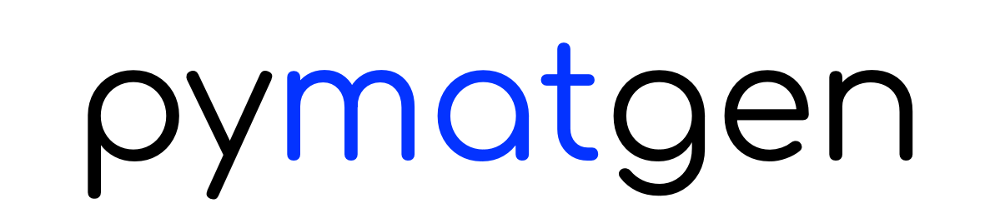
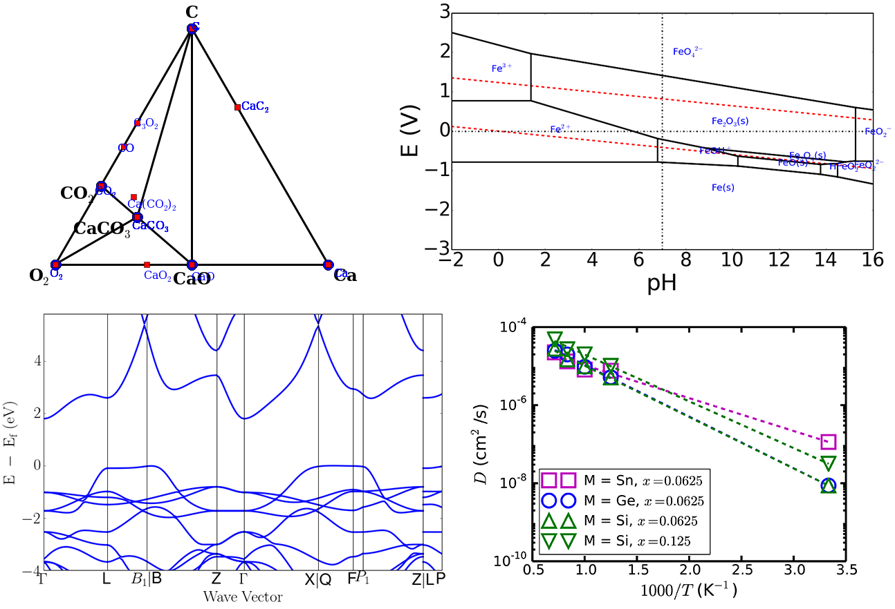

Introduction
============

.. image:: https://circleci.com/gh/materialsproject/pymatgen.svg?style=shield&circle-token=:circle-token

.. image:: https://ci.appveyor.com/api/projects/status/akdyke5jxg6gps45?svg=true

.. image:: https://anaconda.org/conda-forge/pymatgen/badges/downloads.svg

.. image:: https://coveralls.io/repos/github/materialsproject/pymatgen/badge.svg?branch=master

Pymatgen (Python Materials Genomics) is a robust, open-source Python library
for materials analysis. These are some of the main features:

1. Highly flexible classes for the representation of Element, Site, Molecule,
   Structure objects.
2. Extensive input/output support, including support for VASP
   (http://cms.mpi.univie.ac.at/vasp/), ABINIT (http://www.abinit.org/), CIF,
   Gaussian, XYZ, and many other file formats.
3. Powerful analysis tools, including generation of phase diagrams, Pourbaix
   diagrams, diffusion analyses, reactions, etc.
4. Electronic structure analyses, such as density of states and band structure.
5. Integration with the Materials Project REST API, Crystallography Open
   Database.

Pymatgen is free to use. However, we also welcome your help to improve this
library by making your own contributions. These contributions can be in the
form of additional tools or modules you develop, or feature requests and bug
reports. The following are resources for pymatgen:

* Please report any bugs and issues at pymatgen's `Github Issues
  page <https://github.com/materialsproject/pymatgen/issues>`_.
* For help with any pymatgen issue, please use the pymatgen `Discourse page
  <https://discuss.matsci.org/c/pymatgen>`_. Please note that the pymatgen Google
  group has been deprecated in favor of Discourse.
* `Twitter <http://twitter.com/pymatgen>`_. Follow to get news and tips.
* `matgenb <http://matgenb.materialsvirtuallab.org>`_. For example notebooks.

    *The code is mightier than the pen.*

Offline docs
============

If you would like to have an offline version of the docs for reference, there
are two options:

1. Clone the Github repo and the latest html docs are in the "docs" folder.
2. In `Dash <http://kapeli.com/dash>`_ or `Zeal <http://zealdocs.org/>`_, go to
   "User Contributed Docsets", search for pymatgen and install.

Development News
================

Py3k-only with effect from 2019.1.1
~~~~~~~~~~~~~~~~~~~~~~~~~~~~~~~~~~~

Pymatgen has supported both Python 2.7 as well as Python 3.x from version 3.0.
With increasing support by most standard libraries for Py3k, it no longer makes
sense to maintain this dual support going forward. Dual support imposes costs in
terms of developmental effort, and also forces compromises in code quality and
efficiency. Though some legacy clusters may only come with Py2k installed by
default, the recommended approach in any case is to create an isolated Py3k
environment.

The pymatgen development team will phase out Py2k support over the course of
2018. From v2018.1.1, new features implemented in pymatgen no longer need to
support Py2k (i.e., unittests do not need to pass Py2k testing), though
existing features will still be Py2k compatible. From v2019.1.1, pymatgen will
be Py3k only.

Matgenie & Examples
===================

The `Materials Virtual Lab`_ has developed a
`matgenie web app <http://matgenie.materialsvirtuallab.org>`_ which
demonstrates some of the basic functionality of pymatgen, as well as a
`matgenb repository <http://matgenb.materialsvirtuallab.org>`_ of
Jupyter notebooks for common and advanced use cases. We have deprecated the
pymatgen examples page in favor of this more sustainable approach going forward.
One of the ways you can contribute is to fork the matgenb repo and add your own
examples.

Below are a quick look at some of the graphical output possible.

   Top: (left) Phase and (right) Pourbaix diagram from the Materials API.
   Bottom left: Calculated bandstructure plot using pymatgen's parsing and
   plotting utilities. Bottom right: Arrhenius plot using pymatgen's
   DiffusionAnalyzer.

Why use pymatgen?
=================

There are many materials analysis codes out there, both commercial and free.
So you might ask - why should I use pymatgen over others? Pymatgen offer
several advantages over other codes out there:

1. **It is (fairly) robust.** Pymatgen is used by thousands of researchers,
   and is the analysis code powering the `Materials Project`_. The analysis it
   produces survives rigorous scrutiny every single day. Bugs tend to be
   found and corrected quickly. Pymatgen also uses
   `CircleCI <https://circleci.com>`_ and `Appveyor <https://www.appveyor.com/>`_
   for continuous integration on the Linux and Windows platforms,
   respectively, which ensures that every commit passes a comprehensive suite
   of unittests. The coverage of the unittests can be seen on
   `coveralls.io <https://coveralls.io/github/materialsproject/pymatgen>`_.
2. **It is well documented.** A fairly comprehensive documentation has been
   written to help you get to grips with it quickly.
3. **It is open.** You are free to use and contribute to pymatgen. It also means
   that pymatgen is continuously being improved. We will attribute any code you
   contribute to any publication you specify. Contributing to pymatgen means
   your research becomes more visible, which translates to greater impact.
4. **It is fast.** Many of the core numerical methods in pymatgen have been
   optimized by vectorizing in numpy/scipy. This means that coordinate
   manipulations are extremely fast and are in fact comparable to codes
   written in other languages. Pymatgen also comes with a complete system for
   handling periodic boundary conditions.
5. **It will be around.** Pymatgen is not a pet research project. It is used in
   the well-established Materials Project. It is also actively being developed
   and maintained by the `Materials Virtual Lab`_, the ABINIT group and many
   other research groups.

Please review the `coding guidelines </contributing>`_.

.. include:: latest_changes.rst

:doc:`Older versions </change_log>`

Getting pymatgen
================

Via conda (recommended)
~~~~~~~~~~~~~~~~~~~~~~~

If you are absolutely new to Python and/or are using Windows, the easiest
installation process is using `conda <http://conda.pydata.org>`_. If you
already have conda installed, pymatgen can be installed from the `conda-forge
channel <https://anaconda.org/conda-forge>`_ using the following command::

   conda install --channel conda-forge pymatgen

Pymatgen is under active development, and new features are added regularly. To
upgrade pymatgen to the latest version, use the following command::

   conda upgrade pymatgen

Step-by-step instructions for all platforms are available at the
:doc:`installation page </installation>`.

Via pip
~~~~~~~

The version at the Python Package Index (PyPI) is always the latest stable
release that is relatively bug-free. The easiest way to install pymatgen on
any system is to use pip::

    pip install pymatgen

Wheels for Mac and Windows have been built for convenience. To upgrade pymatgen
via pip::

    pip install --upgrade pymatgen

The bleeding edge developmental version is at the pymatgen `Github repo
<https://github.com/materialsproject/pymatgen>`_. The developmental
version is likely to be more buggy, but may contain new features. The
Github version include complete test files. After
cloning the source, you can type in the root of the repo::

    pip install .

or to install the package in developmental mode::

    pip install -e .

Detailed installation instructions, including installation of
option dependencies, set up for POTCAR generation, Materials Project REST
interface usage, setup for developers, etc.are given on this
:doc:`page </installation>`.

For some extras, you can also install the optional dependencies using::

   pip install pymatgen[extra]

For an always up-to-date list of extras, consult the `setup.py's extras_require
<https://github.com/materialsproject/pymatgen/blob/master/setup.py>`_.

.. toctree::
   :maxdepth: 2

   installation

Shared cluster installation
~~~~~~~~~~~~~~~~~~~~~~~~~~~

If you are installing pymatgen on shared computing clusters, e.g., the XSEDE
or NERSC resources in the US, the best way is to use conda to perform a local
install. This guarantees the right version of python and all dependencies::

    wget https://repo.continuum.io/miniconda/Miniconda3-latest-Linux-x86_64.sh
    bash Miniconda3-latest-Linux-x86_64.sh -b

    # Reload bash profile.
    source $HOME/.bashrc
    source $HOME/.bash_profile

    # Install numpy and other pydata stack packages via conda.
    conda install --yes numpy scipy pandas
    conda install --yes --channel conda-forge pymatgen

Usage
=====

.. figure:: _static/overview.jpg
   :width: 100%
   :alt: pymatgen overview
   :align: center

   Overview of a typical workflow for pymatgen.

The figure above provides an overview of the functionality in pymatgen. A
typical workflow would involve a user converting data (structure, calculations,
etc.) from various sources (first principles calculations, crystallographic and
molecule input files, Materials Project, etc.) into Python objects using
pymatgen's io packages, which are then used to perform further structure
manipulation or analyses.

.. _quick_start:

Quick start
~~~~~~~~~~~

Useful aliases for commonly used objects are now provided. Supported objects
include Element, Composition, Structure, Molecule, Spin and Orbital. Here are
some quick examples of the core capabilities and objects:

.. code-block:: pycon

    >>> import pymatgen as mg
    >>>
    >>> si = mg.Element("Si")
    >>> si.atomic_mass
    28.0855
    >>> print(si.melting_point)
    1687.0 K
    >>>
    >>> comp = mg.Composition("Fe2O3")
    >>> comp.weight
    159.6882
    >>> # Note that Composition conveniently allows strings to be treated just
    >>> # like an Element object.
    >>> comp["Fe"]
    2.0
    >>> comp.get_atomic_fraction("Fe")
    0.4
    >>> lattice = mg.Lattice.cubic(4.2)
    >>> structure = mg.Structure(lattice, ["Cs", "Cl"],
    ...                          [[0, 0, 0], [0.5, 0.5, 0.5]])
    >>> structure.volume
    74.088000000000008
    >>> structure[0]
    PeriodicSite: Cs (0.0000, 0.0000, 0.0000) [0.0000, 0.0000, 0.0000]
    >>>
    >>> # You can create a Structure using spacegroup symmetry as well.
    >>> li2o = mg.Structure.from_spacegroup("Fm-3m", mg.Lattice.cubic(3),
                                            ["Li", "O"],
                                            [[0.25, 0.25, 0.25], [0, 0, 0]])
    >>>
    >>> # Integrated symmetry analysis tools from spglib.
    >>> from pymatgen.symmetry.analyzer import SpacegroupAnalyzer
    >>> finder = SpacegroupAnalyzer(structure)
    >>> finder.get_spacegroup_symbol()
    'Pm-3m'
    >>>
    >>> # Convenient IO to various formats. You can specify various formats.
    >>> # Without a filename, a string is returned. Otherwise,
    >>> # the output is written to the file. If only the filenmae is provided,
    >>> # the format is intelligently determined from a file.
    >>> structure.to(fmt="poscar")
    >>> structure.to(filename="POSCAR")
    >>> structure.to(filename="CsCl.cif")
    >>>
    >>> # Reading a structure is similarly easy.
    >>> structure = mg.Structure.from_str(open("CsCl.cif").read(), fmt="cif")
    >>> structure = mg.Structure.from_file("CsCl.cif")
    >>>
    >>> # Reading and writing a molecule from a file. Supports XYZ and
    >>> # Gaussian input and output by default. Support for many other
    >>> # formats via the optional openbabel dependency (if installed).
    >>> methane = mg.Molecule.from_file("methane.xyz")
    >>> mol.to("methane.gjf")
    >>>
    >>> # Pythonic API for editing Structures and Molecules (v2.9.1 onwards)
    >>> # Changing the specie of a site.
    >>> structure[1] = "F"
    >>> print(structure)
    Structure Summary (Cs1 F1)
    Reduced Formula: CsF
    abc   :   4.200000   4.200000   4.200000
    angles:  90.000000  90.000000  90.000000
    Sites (2)
    1 Cs     0.000000     0.000000     0.000000
    2 F     0.500000     0.500000     0.500000
    >>>
    >>> # Changes species and coordinates (fractional assumed for structures)
    >>> structure[1] = "Cl", [0.51, 0.51, 0.51]
    >>> print(structure)
    Structure Summary (Cs1 Cl1)
    Reduced Formula: CsCl
    abc   :   4.200000   4.200000   4.200000
    angles:  90.000000  90.000000  90.000000
    Sites (2)
    1 Cs     0.000000     0.000000     0.000000
    2 Cl     0.510000     0.510000     0.510000
    >>>
    >>> # Replaces all Cs in the structure with K
    >>> structure["Cs"] = "K"
    >>> print(structure)
    Structure Summary (K1 Cl1)
    Reduced Formula: KCl
    abc   :   4.200000   4.200000   4.200000
    angles:  90.000000  90.000000  90.000000
    Sites (2)
    1 K     0.000000     0.000000     0.000000
    2 Cl     0.510000     0.510000     0.510000
    >>>
    >>> # Replaces all K in the structure with K: 0.5, Na: 0.5, i.e.,
    >>> # a disordered structure is created.
    >>> structure["K"] = "K0.5Na0.5"
    >>> print(structure)
    Full Formula (K0.5 Na0.5 Cl1)
    Reduced Formula: K0.5Na0.5Cl1
    abc   :   4.209000   4.209000   4.209000
    angles:  90.000000  90.000000  90.000000
    Sites (2)
      #  SP                   a    b    c
    ---  -----------------  ---  ---  ---
      0  K:0.500, Na:0.500  0    0    0
      1  Cl                 0.5  0.5  0.5
    >>>
    >>> # Because structure is like a list, it supports most list-like methods
    >>> # such as sort, reverse, etc.
    >>> structure.reverse()
    >>> print(structure)
    Structure Summary (Cs1 Cl1)
    Reduced Formula: CsCl
    abc   :   4.200000   4.200000   4.200000
    angles:  90.000000  90.000000  90.000000
    Sites (2)
    1 Cl     0.510000     0.510000     0.510000
    2 Cs     0.000000     0.000000     0.000000
    >>>
    >>> # Molecules function similarly, but with Site and cartesian coords.
    >>> # The following changes the C in CH4 to an N and displaces it by 0.01A
    >>> # in the x-direction.
    >>> methane[0] = "N", [0.01, 0, 0]
    >>>
    >>> # If you set up your .pmgrc.yaml with your Materials Project API key
    >>> # You can now easily grab structures from the Materials Project.
    >>> lifepo4 = mg.get_structure_from_mp("LiFePO4")

The above illustrates only the most basic capabilities of pymatgen. Users are
strongly encouraged to explore the :doc:`usage pages </usage>` (toc given below).

.. toctree::
   :maxdepth: 2

   usage

API documentation
~~~~~~~~~~~~~~~~~

For detailed documentation of all modules and classes, please refer to the
:doc:`API docs </modules>`.

More resources
~~~~~~~~~~~~~~

The founder and maintainer of pymatgen, Shyue Ping Ong, has conducted several
workshops (together with Anubhav Jain) on how to effectively use pymatgen (as
well as the extremely useful `custodian`_ error management and `FireWorks`_
workflow software. The slides for these workshops are available on the
`Materials Virtual Lab`_.

pmg - Command line tool
~~~~~~~~~~~~~~~~~~~~~~~

To demonstrate the capabilities of pymatgen and to make it easy for users to
quickly use the functionality, pymatgen comes with a set of useful scripts
that utilize the library to perform all kinds of analyses. These are
installed to your path by default when you install pymatgen through the
typical installation routes.

Here, we will discuss the most versatile of these scripts, known as
pmg. The typical usage of pmg is::

    pmg {setup, config, analyze, plotdos, plotchgint, convert, symm, view, compare} additional_arguments

At any time, you can use ``"pmg --help"`` or ``"pmg subcommand
--help"`` to bring up a useful help message on how to use these subcommands.
With effect from v4.6.0, ``pmg`` also supports bash completion using
argcomplete, which is useful given the many options available in the cli tool.
To enable argcomplete, ``pip install argcomplete`` and either follow
argcomplete's instructions for enabling global completion, or add the following
line to your ``.bash_profile`` (this method usually works more reliably)::

   eval "$(register-python-argcomplete pmg)"

Here are a few examples of typical usages::

    # Parses all vasp runs in a directory and display the basic energy
    # information. Saves the data in a file called vasp_data.gz for subsequent
    # reuse.

    pmg analyze .

    # Plot the dos from the vasprun.xml file.

    pmg plot --dos vasprun.xml

    # Convert between file formats. The script attempts to intelligently
    # determine the file type. Input file types supported include CIF,
    # vasprun.xml, POSCAR, CSSR. You can force the script to assume certain file
    # types by specifying additional arguments. See pmg convert -h.

    pmg structure --convert --filenames input_filename output_filename.

    # Obtain spacegroup information using a tolerance of 0.1 angstroms.

    pmg structure --symmetry 0.1 --filenames filename1 filename2

    # Visualize a structure. Requires VTK to be installed.

    pmg view filename

    # Compare two structures for similarity

    pmg structure --group element --filenames filename1 filename2

    # Generate a POTCAR with symbols Li_sv O and the PBE functional

    pmg potcar --symbols Li_sv O --functional PBE

Add-ons
~~~~~~~

Some add-ons are available for pymatgen today:

1. The `pymatgen-db <https://pypi.python.org/pypi/pymatgen-db>`_ add-on
   provides tools to create databases of calculated run data using pymatgen.
2. The `custodian`_ package provides a JIT job management and error
   correction for calculations.
3. The `pymatgen-diffusion <https://pypi.python.org/pypi/pymatgen-diffusion>`_
   by the `Materials Virtual Lab`_ provides additional useful analyses for
   diffusion in materials.

Contributing
============

Pymatgen is developed by a team of volunteers. It is started by a team
comprising of MIT and Lawrence Berkeley National Laboratory staff to be a
robust toolkit for materials researchers to perform advanced manipulations of
structures and analyses.

For pymatgen to continue to grow in functionality and robustness, we rely on
other volunteers to develop new analyses and report and fix bugs. We welcome
anyone to use our code as-is, but if you could take a few moment to give back
to pymatgen in some small way, it would be greatly appreciated. A benefit of
contributing is that your code will now be used by other researchers who use
pymatgen, and we will include an acknowledgement to you (and any related
publications) in pymatgen.

Reporting bugs
--------------

A simple way that anyone can contribute is simply to report bugs and issues
to the developing team. Please report any bugs and issues at pymatgen's
`Github Issues page <https://github.com/materialsproject/pymatgen/issues>`_.
For help with any pymatgen issue, consult `Stack Overflow
<https://stackoverflow.com/questions/tagged/pymatgen>`_ and if
you cannot find an answer, please post a question with the tag `pymatgen`.

Developing new functionality
----------------------------

Another way to contribute is to submit new code/bugfixes to pymatgen. The
best way for anyone to develop pymatgen is by adopting the collaborative
Github workflow (see `contributing page </contributing>`_).

How to cite pymatgen
====================

If you use pymatgen in your research, please consider citing the following
work:

    Shyue Ping Ong, William Davidson Richards, Anubhav Jain, Geoffroy Hautier,
    Michael Kocher, Shreyas Cholia, Dan Gunter, Vincent Chevrier, Kristin A.
    Persson, Gerbrand Ceder. *Python Materials Genomics (pymatgen) : A Robust,
    Open-Source Python Library for Materials Analysis.* Computational
    Materials Science, 2013, 68, 314–319. `doi:10.1016/j.commatsci.2012.10.028
    <http://dx.doi.org/10.1016/j.commatsci.2012.10.028>`_

In addition, some of pymatgen's functionality is based on scientific advances
/ principles developed by various scientists. Please refer to the
:doc:`references page </references>` for citation info.

License
=======

Pymatgen is released under the MIT License. The terms of the license are as
follows:

.. literalinclude:: ../LICENSE.rst

About the Team
==============

Shyue Ping Ong of the `Materials Virtual Lab`_ started Pymatgen in 2011, and is
still the project lead.

The Pymatgen Development Team is the set of all contributors to the
pymatgen project, including all subprojects.

The full list of contributors are listed in the :doc:`team page </team>`.

Copyright Policy
================

Pymatgen uses a shared copyright model. Each contributor maintains copyright
over their contributions to pymatgen. But, it is important to note that these
contributions are typically only changes to the repositories. Thus, the
pymatgen source code, in its entirety is not the copyright of any
single person or institution. Instead, it is the collective copyright of the
entire pymatgen Development Team. If individual contributors want to maintain a
record of what changes/contributions they have specific copyright on, they
should indicate their copyright in the commit message of the change, when
they commit the change to one of the pymatgen repositories.

With this in mind, the following banner should be used in any source code file
to indicate the copyright and license terms::

    # Copyright (c) Pymatgen Development Team.
    # Distributed under the terms of the MIT License.

Indices and tables
==================

* :ref:`genindex`
* :ref:`modindex`
* :ref:`search`

.. _`PyPI`: http://pypi.python.org/pypi/pymatgen
.. _`Github page`: https://github.com/materialsproject/pymatgen/issues
.. _`custodian`: https://pypi.python.org/pypi/custodian
.. _`FireWorks`: https://materialsproject.github.io/fireworks
.. _`Materials Project`: https://www.materialsproject.org
.. _`Materials Virtual Lab`: http://www.materialsvirtuallab.org
